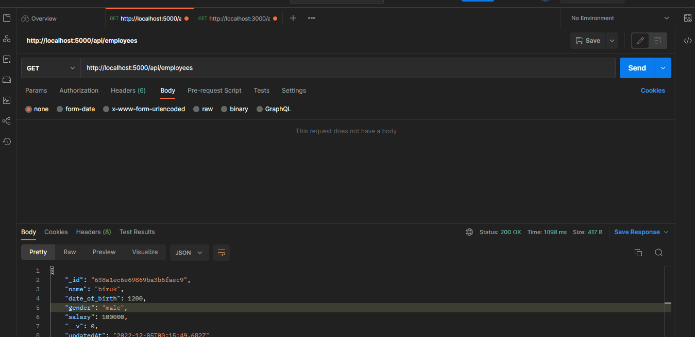
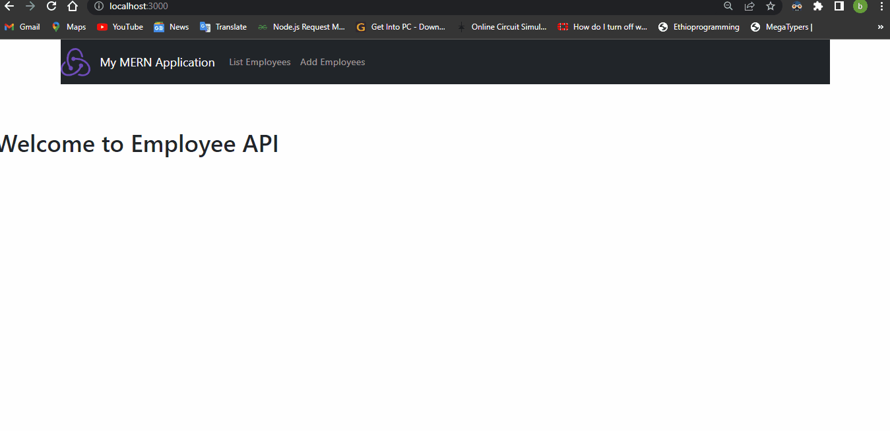

# mern-stack 

Rest API that will let you manage employees. API will be able to
create , list, update and remove employees

## Deployed website
- [@[Birhanus](https://mern-stack-frontend-pfkb.onrender.com)]([https://www.github.com/birhanus](https://mern-stack-frontend-pfkb.onrender.com))

## Installation

Install my-project with npm

```bash
  git clone https://github.com/Birhanus/mern-stack.git
  cd mern-stack
  npm Install
  cd frontend
  npm Install
  cd ..
  npm run both
```
    
## Demo

### Test demo from postmon


### Test demo from frontend UI



## Authors

- [@Birhanus](https://www.github.com/birhanus)

